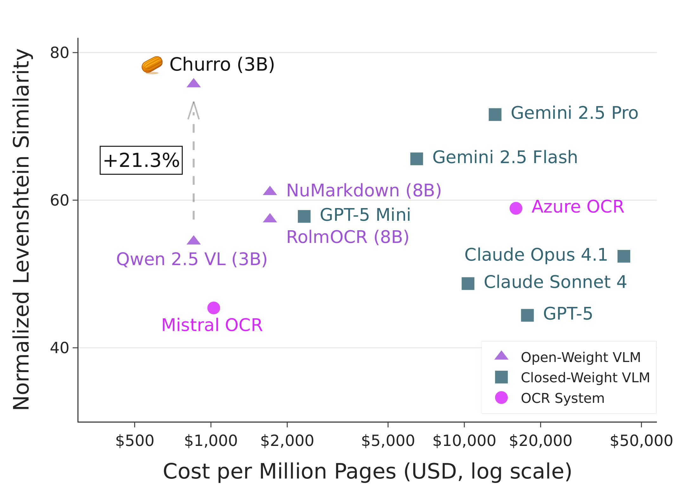

<p align="center">
	
	<p align="center">CHURRO: Making History Readable with an Open-Weight Large Vision-Language Model for High-Accuracy, Low-Cost Historical Text Recognition</p>
	<p align="center">
		<a href="https://huggingface.co/stanford-oval/churro-3B" target="_blank"></a>
        <a href="https://huggingface.co/datasets/stanford-oval/churro-dataset" target="_blank"></a>
		<a href="https://arxiv.org/abs/2509.19768" target="_blank"></a>
		<a href="https://github.com/stanford-oval/churro/stargazers" target="_blank"></a>
	</p>
</p>

<p align="center">
	<sub><i>Handwritten and printed text recognition across 22 centuries and 46 language clusters, including historical and dead languages.</i></sub>
</p>

<p align="center">
    
    <br/>
    <sub><i>Cost vs. accuracy: CHURRO (3B) achieves higher accuracy than much larger commercial and open-weight VLMs while being substantially cheaper.</i></sub>
</p>

---
## Table of Contents
1. [Overview](#overview)
2. [Installation](#installation)
3. [Directory Structure](#directory-structure)
4. [Quick Start](#quick-start)
5. [PDF Processing Pipeline](#pdf-processing-pipeline)
6. [Benchmarking a VLM or OCR system on CHURRO-DS](#benchmarking-a-vlm-or-ocr-system-on-churro-ds)
7. [Adding a New OCR System](#adding-a-new-ocr-system)
8. [Citation](#citation)
9. [License](#license)

---

## Overview
**CHURRO** is a 3B-parameter open-weight vision-language model (VLM) for historical document transcription. It is trained on **CHURRO-DS**, a curated dataset of ~100K pages from 155 historical collections spanning 22 centuries and 46 language clusters.

On the CHURRO-DS test set, CHURRO delivers **15.5× lower cost than Gemini 2.5 Pro while exceeding its accuracy**.

## Installation
### 1. System Packages (Ubuntu example)
```bash
sudo apt-get update && sudo apt-get install -y \
  libtiff5-dev libjpeg8-dev libopenjp2-7-dev zlib1g-dev libfreetype6-dev \
  liblcms2-dev libwebp-dev tcl8.6-dev tk8.6-dev python3-tk libharfbuzz-dev \
  libfribidi-dev libxcb1-dev
```

### 2. (Optional) Install Docker
If you plan to use the CHURRO model or other local VLMs, install Docker.
Follow the official guide at https://docs.docker.com/engine/install/
Local models work on CPU-only machines as well, but performance will be significantly slower.
If you have an NVIDIA GPU, also install the NVIDIA Container Toolkit by following the official guide: https://docs.nvidia.com/datacenter/cloud-native/container-toolkit/install-guide.html

### 3. Clone Repository
```bash
git clone https://github.com/stanford-oval/churro.git
cd churro
```

### 4. Install Pixi
For Python packages, we use [pixi](https://pixi.sh) to manage virtual environments and dependencies. Install via:
```bash
curl -fsSL https://pixi.sh/install.sh | bash
pixi shell   # initializes & enters the environment
```
The first invocation may take several minutes while dependencies resolve.

### 5. Environment Variables
```bash
cp .example.env .env
```
Fill only the variables you need (see the comments in the file for more details). Values are auto-loaded via `python-dotenv`.

---

## Directory Structure
```
ocr/                OCR system implementations
evaluation/         Metrics, and evaluation utilities
utils/              Shared helpers (LLM routing, PDF pipeline, logging, docker)
page/               Page layout abstractions (bounding boxes, polygons, visualization)
tests/              LLM and integration tests
pdf_dir_to_images.py PDF to page image conversion utility
run_churro_ocr.py   Single-image or directory inference using CHURRO (3B)
benchmark_vlm.py    End-to-end evaluation orchestration for various models and systems
```

---


## Quick Start
Single image (local CHURRO model):
```bash
python run_churro_ocr.py --engine churro --image tests/ahisto_103_84.jpeg --max-concurrency 8
```
Batch directory:
```bash
python run_churro_ocr.py --engine churro \
  --image-dir path/to/images --pattern "*.png" \
  --output-dir workdir/texts --max-concurrency 8
```
For the full list of options run:
```bash
python run_churro_ocr.py --help
```

The script automatically launches a vLLM container if not already running locally.

---

## PDF Processing Pipeline
Convert PDF pages to images before OCR:
```bash
python pdf_dir_to_images.py --pdf path/to/file.pdf --output-dir workdir/images --dpi 300
```
Outputs will be named `<pdf_base>_page_XXXX.png`.

---

## Benchmarking a VLM or OCR system on CHURRO-DS
We provide an end-to-end evaluation workflow that runs a specified OCR system on the CHURRO-DS test set and computes accuracy metrics.


`benchmark_vlm.py` orchestrates:
1. Loading a split from the CHURRO-DS dataset (`stanford-oval/churro-dataset` on 🤗 Hub).
2. Spinning up a local vLLM container automatically if the selected engine is a local model (any key with an `hf_repo` in `MODEL_MAP`).
3. Running the requested OCR system (see `--system` choices).
4. Computing metrics per example, per language and per document type, as well as cost and elapsed time and writing:
	 - Raw predictions + references: `outputs.json`
	 - Metrics JSON: `all_metrics.json`

Outputs are placed under: `workdir/results/<split>/<system>_<engine>` (engine suffix omitted for `azure` and `mistral_ocr`). If the directory already exists and is non-empty, you'll be prompted before overwriting.

#### Key Arguments
| Flag | Description |
|------|-------------|
| `--system {azure,mistral_ocr,llm,hybrid,finetuned}` | Which type of OCR system to evaluate. |
| `--engine <logical_engine_key>` | Required for `llm`, `hybrid`, and `finetuned` (e.g. `churro`, `gpt-4o`, `qwen25-7b`). Must exist in `utils/llm/models.py:MODEL_MAP`. |
| `--dataset-split {dev,test}` | Which split of CHURRO-DS to evaluate. |
| `--input-size N` | Limit number of pages (0 = all). Useful for quick smoke runs. |
| `--max-concurrency M` | Max parallel requests to the LLM backend. Tune to avoid rate limits. |
| `--resize PX` | (Optional) Resize large page images to fit within a PX square before OCR. |
| `--tensor-parallel-size T` | vLLM tensor parallelism for local models. |
| `--data-parallel-size D` | vLLM data parallelism for local models. |


Run `python benchmark_vlm.py --help` for more details.


## Adding a New OCR System
Pull requests for new VLMs and OCR backends are welcome.

1. Add a logical key + provider candidates to `utils/llm/models.py` (`MODEL_MAP`).
2. (If local) ensure the HF repo ID is set (`hf_repo`) so the vLLM helper can pull it.
3. Use the key with `--engine <your_key>` in scripts or instantiate systems via `OCRFactory`.
4. For custom OCR logic, subclass `BaseOCR` and implement `process()` & `get_system_name()`, then register in `OCRFactory._ocr_classes`.

---

## Citation
If you use CHURRO or CHURRO-DS, please cite:

```bibtex
@inproceedings{semnani2025churro,
	title        = {{CHURRO}: Making History Readable with an Open-Weight Large Vision-Language Model for High-Accuracy, Low-Cost Historical Text Recognition},
	author       = {Semnani, Sina J. and Zhang, Han and He, Xinyan and Tekg{"u}rler, Merve and Lam, Monica S.},
	booktitle    = {Proceedings of the 2025 Conference on Empirical Methods in Natural Language Processing (EMNLP 2025)},
	year         = {2025}
}
```

---

## License
- Model Weights: Qwen research license (see HF model card)
- Dataset: Due to licensing restrictions on the original datasets used in Churro, use is permitted for research purposes only.
- Code: Apache 2.0
