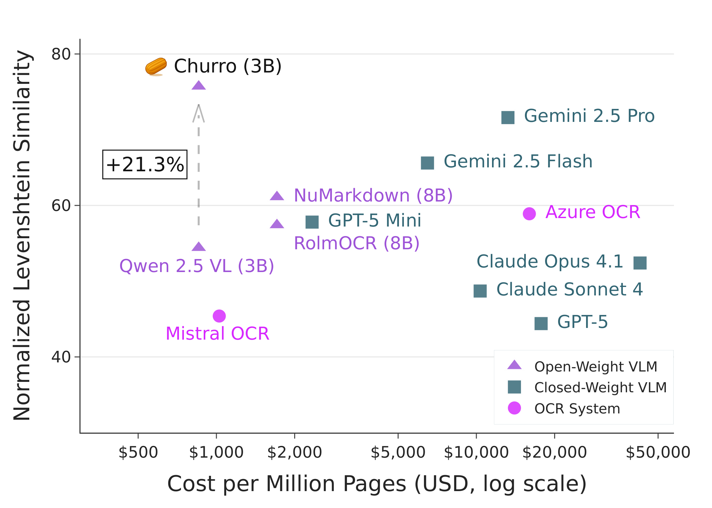

#  CHURRO

CHURRO is an OCR toolkit for historical document transcription, built to make handwritten and printed sources readable at high accuracy and lower cost.

It works with all major OCR proividers and vision-language models, and provides first-party support for the CHURRO 3B model and CHURRO-DS dataset.

[](https://huggingface.co/stanford-oval/churro-3B)
[](https://huggingface.co/datasets/stanford-oval/churro-dataset)
[](https://arxiv.org/abs/2509.19768)
[](https://stanford-oval.github.io/Churro/)
[](https://stanford-oval.github.io/Churro/leaderboard.html)
[](https://github.com/stanford-oval/churro/stargazers)


- CHURRO 3B exceeds the accuracy of Gemini 2.5 Pro at 15.5x lower cost.
- CHURRO-DS contains ~100K pages from 155 historical collections spanning 22 centuries and 46 language clusters.

<p align="center">
  
  <br/>
  <sub><i>Cost vs. accuracy: CHURRO (3B) achieves higher accuracy than much larger commercial and open-weight VLMs while being substantially cheaper.</i></sub>
</p>

## Quick Try

```bash
pip install "churro-ocr[hf]"
churro-ocr transcribe --image scan.png --backend hf --model stanford-oval/churro-3B
```

For more in-depth information, see the [Getting Started](https://stanford-oval.github.io/Churro/getting-started.html) guide.

## Citation

If you use CHURRO or CHURRO-DS, please cite:

```bibtex
@inproceedings{semnani2025churro,
	title        = {{CHURRO}: Making History Readable with an Open-Weight Large Vision-Language Model for High-Accuracy, Low-Cost Historical Text Recognition},
	author       = {Semnani, Sina J. and Zhang, Han and He, Xinyan and Tekg{"u}rler, Merve and Lam, Monica S.},
	booktitle    = {Proceedings of the 2025 Conference on Empirical Methods in Natural Language Processing (EMNLP 2025)},
	year         = {2025}
}
```

## License

- Model weights: Qwen research license
- Dataset: research use only because of the underlying source licenses
- Code: Apache 2.0
