<div align="center">

#  Churro

</div>

<p align="center">
  <a href="https://huggingface.co/stanford-oval/churro-3B">🤗 Model</a> •
  <a href="https://huggingface.co/datasets/stanford-oval/churro-dataset">🗂️ Dataset</a> •
  <a href="https://arxiv.org/abs/2509.19768">📄 Paper</a>
  <br/><br/>
  <a href="https://stanford-oval.github.io/Churro/">📚 Docs</a> •
  <a href="https://stanford-oval.github.io/Churro/leaderboard.html">🏆 Leaderboard</a> •
  <a href="https://github.com/stanford-oval/churro/stargazers">
    
  </a>
</p>

Churro is the fastest way to turn hard-to-read historical scans into reliable text. It gives researchers, libraries, archives, and product teams a unified OCR toolkit for handwritten and printed sources, combining high accuracy, low operating cost, and a clean Python API and CLI workflow.

## Supported OCR Models and Backends

**We provide first-party support for Churro VLM, the best OCR model for historical documents.**

Churro also includes built-in profiles, templates, and post-processing for many other models and integrations, including:

- Hosted vision-language models, including Gemini, GPT, Claude, and more, through LiteLLM integration
- OpenAI-compatible servers, including vLLM, Ollama, TGI, and more
- Azure Document Intelligence
- Mistral OCR
- `Chandra OCR`
- `DeepSeek OCR`
- `Dots OCR`
- `MinerU`
- `Infinity Parser`
- `PaddleOCR VL`
- `LFM VL`


## Quick Start

Python 3.12+ and `uv` are required.

```bash
uv tool install churro-ocr
churro-ocr install hf
churro-ocr transcribe --image scan.png --backend hf --model stanford-oval/churro-3B
```

For more in-depth information, see the [Getting Started](https://stanford-oval.github.io/Churro/getting-started.html) guide.

## Churro Model and Dataset


- Churro 3B VLM exceeds the accuracy of Gemini 2.5 Pro at 15.5x lower cost.
- Churro-DS dataset contains ~100K pages from 155 historical collections spanning 22 centuries and 46 language clusters.

<p align="center">
  
  <br/>
  <sub><i>Cost vs. accuracy: Churro (3B) achieves higher accuracy than much larger commercial and open-weight VLMs while being substantially cheaper.</i></sub>
</p>

The following are pages from the CHURRO dev set, randomly picked from the subset where Churro outperforms Gemini 2.5 Pro on the main metric, Normalized Levenshtein Similarity (NLS).

<table>
  <tr>
    <td width="20%" valign="top" align="center">
      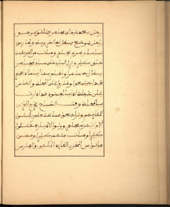
      <br/>
      <strong>Arabic</strong><br/>
      <sub>handwriting</sub><br/>
      <sub>Churro 93.9 vs Gemini 92.3 NLS</sub>
    </td>
    <td width="20%" valign="top" align="center">
      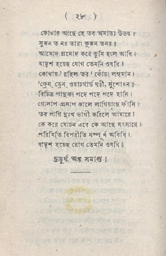
      <br/>
      <strong>Bangla</strong><br/>
      <sub>print</sub><br/>
      <sub>Churro 91.4 vs Gemini 84.3 NLS</sub>
    </td>
    <td width="20%" valign="top" align="center">
      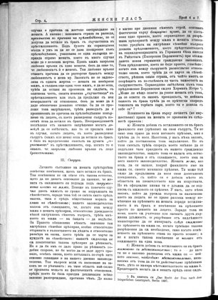
      <br/>
      <strong>Bulgarian</strong><br/>
      <sub>print</sub><br/>
      <sub>Churro 99.8 vs Gemini 99.2 NLS</sub>
    </td>
    <td width="20%" valign="top" align="center">
      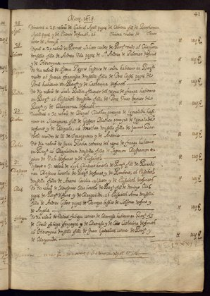
      <br/>
      <strong>Catalan</strong><br/>
      <sub>handwriting</sub><br/>
      <sub>Churro 95.2 vs Gemini 94.1 NLS</sub>
    </td>
    <td width="20%" valign="top" align="center">
      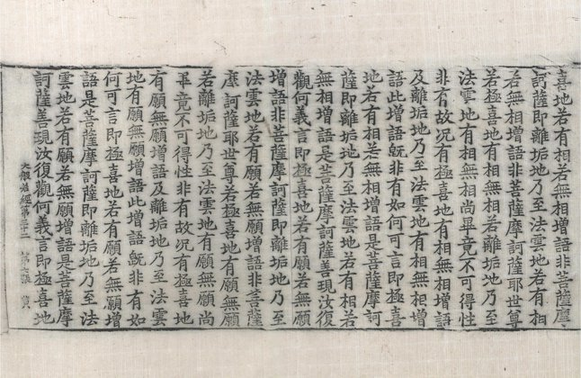
      <br/>
      <strong>Chinese</strong><br/>
      <sub>handwriting</sub><br/>
      <sub>Churro 100.0 vs Gemini 95.0 NLS</sub>
    </td>
  </tr>
  <tr>
    <td width="20%" valign="top" align="center">
      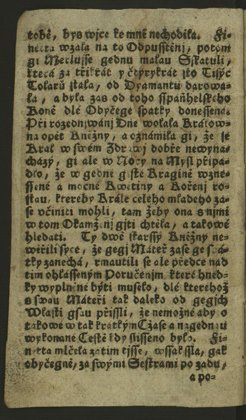
      <br/>
      <strong>Czech</strong><br/>
      <sub>print</sub><br/>
      <sub>Churro 95.9 vs Gemini 95.3 NLS</sub>
    </td>
    <td width="20%" valign="top" align="center">
      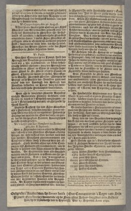
      <br/>
      <strong>Dutch</strong><br/>
      <sub>print</sub><br/>
      <sub>Churro 98.7 vs Gemini 98.0 NLS</sub>
    </td>
    <td width="20%" valign="top" align="center">
      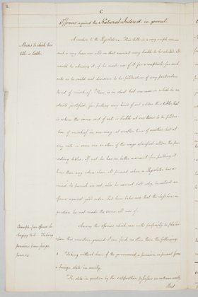
      <br/>
      <strong>English</strong><br/>
      <sub>handwriting</sub><br/>
      <sub>Churro 99.8 vs Gemini 99.4 NLS</sub>
    </td>
    <td width="20%" valign="top" align="center">
      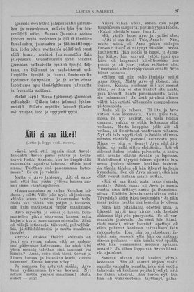
      <br/>
      <strong>Finnish</strong><br/>
      <sub>print</sub><br/>
      <sub>Churro 99.6 vs Gemini 99.5 NLS</sub>
    </td>
    <td width="20%" valign="top" align="center">
      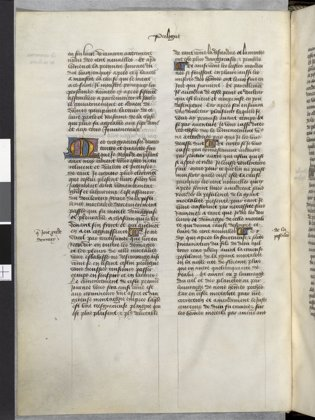
      <br/>
      <strong>French</strong><br/>
      <sub>handwriting</sub><br/>
      <sub>Churro 92.6 vs Gemini 90.6 NLS</sub>
    </td>
  </tr>
  <tr>
    <td width="20%" valign="top" align="center">
      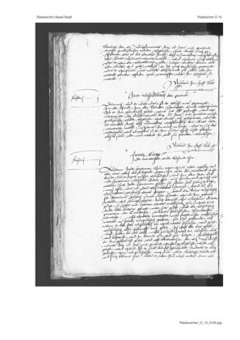
      <br/>
      <strong>German</strong><br/>
      <sub>handwriting</sub><br/>
      <sub>Churro 81.4 vs Gemini 45.6 NLS</sub>
    </td>
    <td width="20%" valign="top" align="center">
      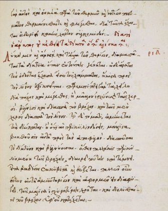
      <br/>
      <strong>Greek</strong><br/>
      <sub>handwriting</sub><br/>
      <sub>Churro 81.2 vs Gemini 71.2 NLS</sub>
    </td>
    <td width="20%" valign="top" align="center">
      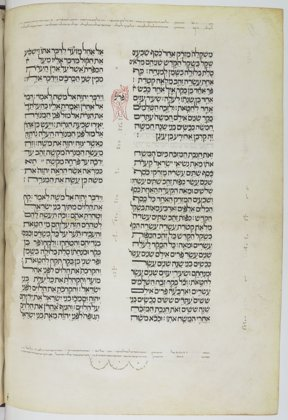
      <br/>
      <strong>Hebrew</strong><br/>
      <sub>handwriting</sub><br/>
      <sub>Churro 90.0 vs Gemini 21.6 NLS</sub>
    </td>
    <td width="20%" valign="top" align="center">
      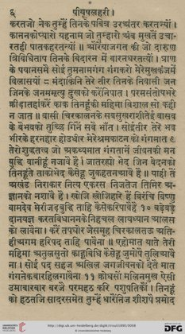
      <br/>
      <strong>Hindi</strong><br/>
      <sub>print</sub><br/>
      <sub>Churro 98.1 vs Gemini 88.0 NLS</sub>
    </td>
    <td width="20%" valign="top" align="center">
      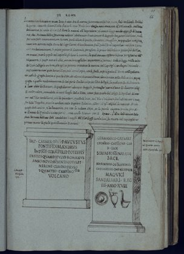
      <br/>
      <strong>Italian</strong><br/>
      <sub>handwriting</sub><br/>
      <sub>Churro 93.3 vs Gemini 88.3 NLS</sub>
    </td>
  </tr>
  <tr>
    <td width="20%" valign="top" align="center">
      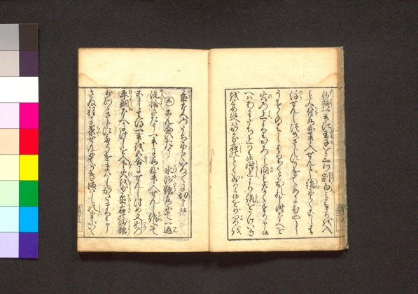
      <br/>
      <strong>Japanese</strong><br/>
      <sub>handwriting</sub><br/>
      <sub>Churro 68.9 vs Gemini 13.8 NLS</sub>
    </td>
    <td width="20%" valign="top" align="center">
      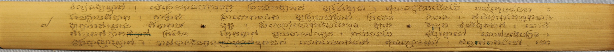
      <br/>
      <strong>Khmer</strong><br/>
      <sub>handwriting</sub><br/>
      <sub>Churro 27.7 vs Gemini 23.3 NLS</sub>
    </td>
    <td width="20%" valign="top" align="center">
      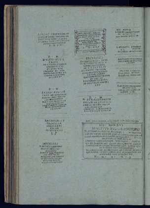
      <br/>
      <strong>Latin</strong><br/>
      <sub>handwriting</sub><br/>
      <sub>Churro 75.1 vs Gemini 58.3 NLS</sub>
    </td>
    <td width="20%" valign="top" align="center">
      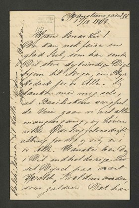
      <br/>
      <strong>Norwegian</strong><br/>
      <sub>handwriting</sub><br/>
      <sub>Churro 69.7 vs Gemini 65.3 NLS</sub>
    </td>
    <td width="20%" valign="top" align="center">
      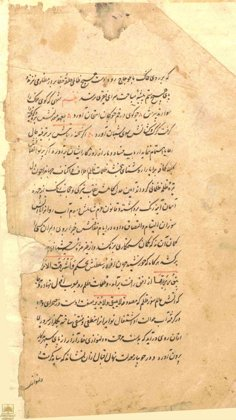
      <br/>
      <strong>Persian</strong><br/>
      <sub>handwriting</sub><br/>
      <sub>Churro 77.6 vs Gemini 74.6 NLS</sub>
    </td>
  </tr>
  <tr>
    <td width="20%" valign="top" align="center">
      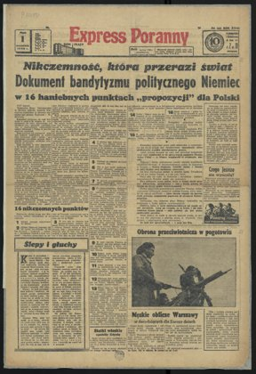
      <br/>
      <strong>Polish</strong><br/>
      <sub>print</sub><br/>
      <sub>Churro 84.4 vs Gemini 0.0 NLS</sub>
    </td>
    <td width="20%" valign="top" align="center">
      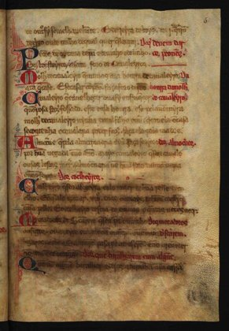
      <br/>
      <strong>Portuguese</strong><br/>
      <sub>handwriting</sub><br/>
      <sub>Churro 52.0 vs Gemini 51.6 NLS</sub>
    </td>
    <td width="20%" valign="top" align="center">
      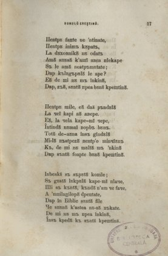
      <br/>
      <strong>Romanian</strong><br/>
      <sub>print</sub><br/>
      <sub>Churro 90.9 vs Gemini 45.7 NLS</sub>
    </td>
    <td width="20%" valign="top" align="center">
      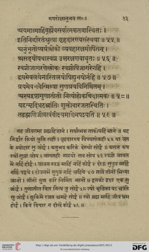
      <br/>
      <strong>Sanskrit</strong><br/>
      <sub>print</sub><br/>
      <sub>Churro 97.5 vs Gemini 97.0 NLS</sub>
    </td>
    <td width="20%" valign="top" align="center">
      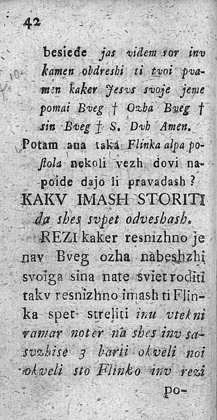
      <br/>
      <strong>Slovenian</strong><br/>
      <sub>print</sub><br/>
      <sub>Churro 98.7 vs Gemini 98.5 NLS</sub>
    </td>
  </tr>
  <tr>
    <td width="20%" valign="top" align="center">
      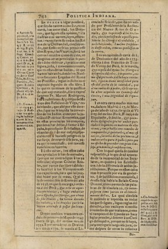
      <br/>
      <strong>Spanish</strong><br/>
      <sub>print</sub><br/>
      <sub>Churro 97.9 vs Gemini 78.5 NLS</sub>
    </td>
    <td width="20%" valign="top" align="center">
      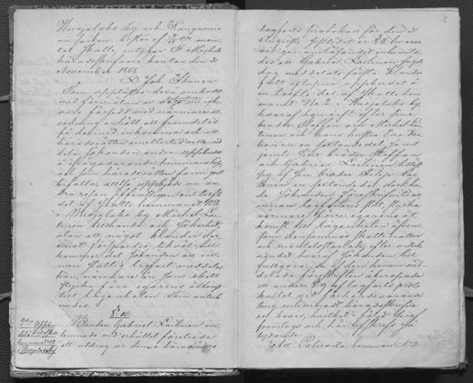
      <br/>
      <strong>Swedish</strong><br/>
      <sub>handwriting</sub><br/>
      <sub>Churro 87.1 vs Gemini 85.1 NLS</sub>
    </td>
    <td width="20%" valign="top" align="center">
      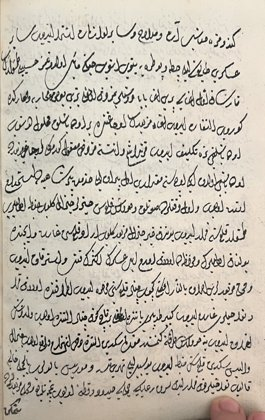
      <br/>
      <strong>Turkish</strong><br/>
      <sub>handwriting</sub><br/>
      <sub>Churro 74.1 vs Gemini 42.9 NLS</sub>
    </td>
    <td width="20%" valign="top" align="center">
      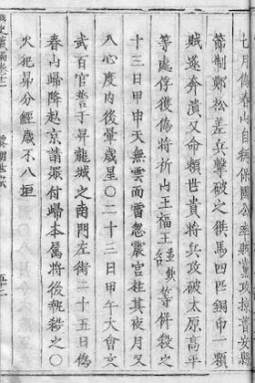
      <br/>
      <strong>Vietnamese</strong><br/>
      <sub>handwriting</sub><br/>
      <sub>Churro 87.6 vs Gemini 86.0 NLS</sub>
    </td>
  </tr>
</table>

## Citation

If you use CHURRO or CHURRO-DS, please cite:

```bibtex
@inproceedings{semnani2025churro,
	title        = {{CHURRO}: Making History Readable with an Open-Weight Large Vision-Language Model for High-Accuracy, Low-Cost Historical Text Recognition},
	author       = {Semnani, Sina J. and Zhang, Han and He, Xinyan and Tekg{"u}rler, Merve and Lam, Monica S.},
	booktitle    = {Proceedings of the 2025 Conference on Empirical Methods in Natural Language Processing (EMNLP 2025)},
	year         = {2025}
}
```

## License

- Code: Apache 2.0
- Model weights: Qwen research license
- Dataset: research use only because of the underlying source licenses
